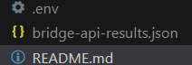

# bridge-api-assignment

## Project description:
Get an overview of a dummy customer's banking situation. 
To do this, we're going to consume the API of **Bridge**, the B2B service of Bankin, a leader in bank account aggregation.

This is a NodeJS script that uses superagent http client and returns a JSON object containing:
- the authentication **token** information provided by Bridge ;
- the list of bank **items** with their details ;
- the list of **accounts** linked to the same items;
- the last 2 bank **transactions**.

**!Important**: We suppose for the sake of this exercice, to retrieve all the items and accounts of the user.

The JSON file will have the following formalism:

``` JSON
{
	"access_token": {
		"value": ...,
		"expires_at": ...
	},
	"items": [
		{
      "id": ...,
      "status": ...,
      "status_code_info": ...,
      "status_code_description": ...,
      "bank_id": ...,
			"accounts": [
		    {
		      "id": ...,
		      "name": ...,
		      "balance": ...,
		      "status": ...,
		      "status_code_info": ...,
		      "status_code_description": ...,
		      "updated_at": ...,
		      "type": ...,
		      "currency_code": ...,
		      "iban": ...
		    },
		    ...
		  ]
    },
		...
  ],
	"transactions": [
		{
      "id": ...,
      "clean_description": ...,
      "bank_description": ...,
      "amount": ...,
      "date": ...,
      "updated_at": ...,
      "currency_code": ...,
      "is_deleted": ...,
      "category_id": ...,
      "account_id": ...,
      "is_future": ...,
      "show_client_side": ...
    },
		...
	]
}
```

## Installation:
Type in cmd :
```bash
git clone https://github.com/rinnaaza/bridge-api-assignment.git
cd bridge-api
```

Once you have the repository locally: 

```bash
npm install
```

## Configuration:
Create `.env` file in the root that will have the following environment variables:
```
BRIDGE_API_BASE_URL = ""
BRIDGE_API_CLIENT_ID = ""
BRIDGE_API_CLIENT_SECRET = ""
BRIDGE_API_VERSION = ""
EMAIL = ""
PASSWORD = ""
```

Type in cmd:
```bash
npm start
```

A file named `bridge-api-results.json` will be generated and will appear in the root of the repository.


